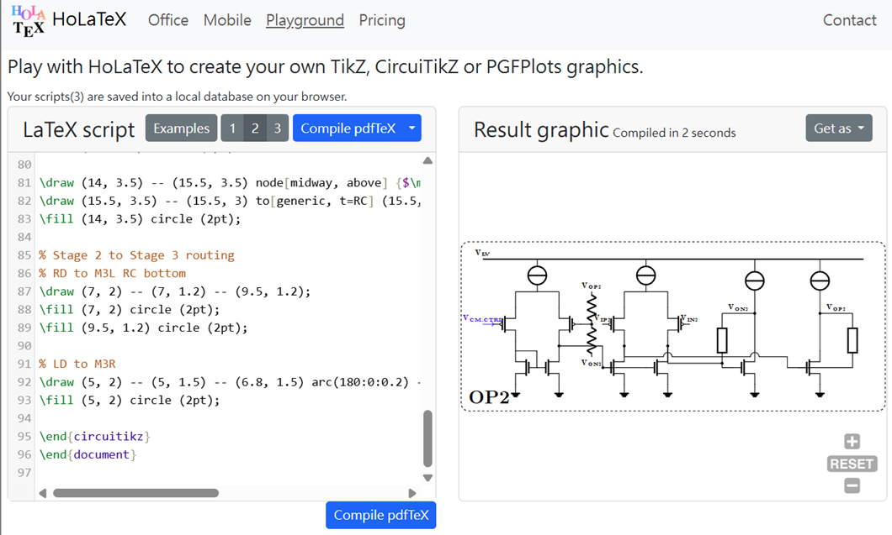
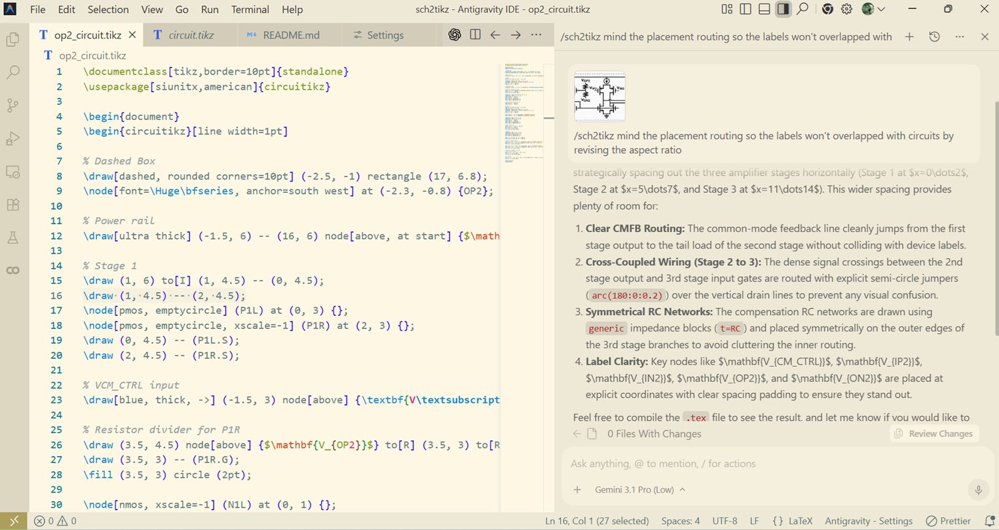
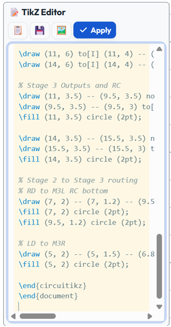
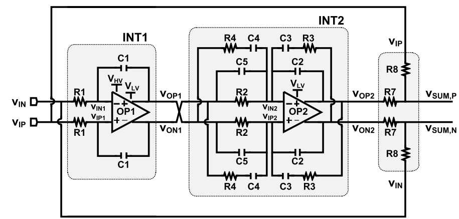

#  VisioCirkit

> [!IMPORTANT]
> This repository is a fork of the original [CircuiTi*k*Z-Designer](https://github.com/Circuit2TikZ/CircuiTikZ-Designer).

## 🎨 About This Project

**VisioCirkit** is a schematic editor tailored for academic research and engineering development! We aim to eliminate the pain of manually writing LaTeX/TikZ code, letting you design, customize, and export high-quality LaTeX circuit diagrams in the most intuitive way possible! 🎨

### ✨ Key Features

- **🔄 Two-Way Sync (TikZ Editor & GUI)**: Real-time synchronization! Modifying the code instantly updates the visual canvas, and manipulating components on the GUI updates the TikZ code simultaneously.
- **🛠️ Custom Symbol Editor**: Inspect and dynamically modify sub-path attributes (like thickness, coordinates, etc.) of custom components.
- **🌟 Rich Enhancements**:
    1. **Custom Categories & Subcircuits**: Organize your design workspace with custom component categories and custom subcircuits.
    2. **Visual Subcircuit Previews**: The symbols panel displays actual, accurate graphical previews of your subcircuits instead of generic boxes!
    3. **Symbol Grouping**: Group multiple components together and save them as reusable custom symbols.
    4. **Premium Academic Theme**: Redesigned UI styling with a tailored dark mode palette and smooth gradients to reduce eye strain during long hours of research.
- **👁️ Live LaTeX Rendering**:
    - **Primary Renderer**: Powered by the **QuickLaTeX API** for high-quality cloud LaTeX compilation, supporting all complex CircuiTikZ syntax and fonts!

---

## 🖼️ Feature & Conversion Demos

Below are the main interface features of **VisioCirkit** and side-by-side comparison showcases demonstrating the results of the AI Agent's **Schematic-to-TikZ** conversion.

### 🎨 Visio-Style GUI & AI Integration

The following shows the GUI features and integration with the AI Agent:

| Feature Description                                                                                                                                          | Interface Showcase                                                        |
| :----------------------------------------------------------------------------------------------------------------------------------------------------------- | :------------------------------------------------------------------------ |
| **Sallen-Key Filter GUI Editing**<br>Demonstrates the drag-and-drop interface and TikZ editor with two-way editing.                                          |                   |
| **Online Latex Rendering for Verification** <br>Demonstrates the code generated through the Visual Editor and verified by the online HolaTeX cloud renderer. |             |
| **In-IDE AI Agent Prompting**<br>Demonstrates the dialog process with the AI Agent in the Antigravity IDE to convert schematics in papers.                   |  |
| **TikZ Editor Two-Way Sync**<br>Directly invoke the TikZ editor in the IDE to quickly edit code and preview in real-time.                                    |           |

---

### 🛠️ Custom Symbol Editor

The Custom Symbol Editor allows users to dynamically modify sub-path attributes, pin definitions, and view SVG previews in a Visio-style interface:

|                          Attribute & Preview                          |                          Pins & Anchors                          |
| :-------------------------------------------------------------------: | :--------------------------------------------------------------: |
|           |       |
|                   **Symbol Editor Main Interface**                    |    **Define component connection pins and anchor positions**     |
|  |  |
|       **Adjust coordinates and thickness of sub-path segments**       |           **Preview SVG vector paths and appearance**            |

---

### 🤖 Schematic to TikZ Conversion Showcase

Use the AI Agent skill `/sch2tikz` to convert schematic to tikz code which are rendered in svg. A good start to visually edit the schematic instead of starting from scratch. Below are side-by-side comparisons of the original schematic inputs and their converted vector outputs.

> [!TIP]
> While the TikZ code converted directly via the `/sch2tikz` skill might not be flawless initially, combining it with VisioCirkit's real-time two-way sync editing should still save users a significant amount of design time.

#### 1. DCDC Buck Converter

|                    Original Schematic                    |                  Converted & Rendered CircuiTikZ                  |
| :------------------------------------------------------: | :---------------------------------------------------------------: |
|  |  |

#### 2. Fully Differential Two-Stage Integrator

|                        Original Schematic                        |              Converted & Rendered CircuiTikZ              |
| :--------------------------------------------------------------: | :-------------------------------------------------------: |
|  |  |

---

> [!WARNING]
>
> - **Always Backup Your TikZ Code!** 💾 VisioCircuit uses the TikZ code in the editor as the **single source of truth** for your design. To prevent any data loss, please copy and backup your `.tikz` code frequently.
> - **TikZ Code Alteration & Comments Loss**: Pressing **Apply** in the TikZ editor synchronizes the code to the visual canvas. This process will restructure your TikZ code and completely discard all LaTeX comments (`% ...`). Please keep an external backup of your code if you want to preserve formatting or comments.
> - **Alternative Preview Option**: As the app is still under active development, rendering bugs may occasionally occur. If you suspect an incorrect render, you can verify your TikZ code in an alternative online previewer such as the [HolaTeX Playground](https://holatex.app/playground.html).

---

## 🚀 Use Locally

1. Make sure you have [Node.js](https://nodejs.org/) installed.
2. Clone the repository to your local machine.
3. Install the dependencies:
    ```bash
    npm install
    ```
4. Start the local development server:
    ```bash
    npm start
    ```
5. Open your browser and navigate to the local URL (default is `http://localhost:1234`) to start designing!

---

## 📦 Demo Build & Deployment

- The default `npm run build` keeps the app in `server` runtime mode.
- To deploy to static hosts like Vercel, run `npm run build:demo`. This updates `<meta name="circuitikz-runtime" ...>` to `demo`.
- The deployed demo artifact boots with:
    - `storageMode = "indexeddb"`
    - `templateSource = "static-manifest"`
    - `latexMode = "serverless-proxy"`

**Recommended Demo Deployment Flow**:

1. Switch to the `demo/b-local-storage-vercel` branch.
2. Run `npm install`.
3. Build, test, and automatically verify the static build preset:
    ```bash
    npm run deploy:demo
    ```
    _(This command automatically runs vitest unit tests, builds the demo version, and runs the verifier script to ensure the static index.html is correctly pinned to the demo runtime mode.)_
4. Deploy the generated `dist/` directory to your static host, and ensure the serverless backend proxy `api/latex.js` is available.

---

## 💡 Help & Contributing

- **How to Use**: Click the question mark icon `?` in the top right corner of the application to view the interactive help menu and shortcut keys.
- **Discussions**: If you have any questions, feel free to start a thread on [General Discussions](https://github.com/Circuit2TikZ/CircuiTikZ-Designer/discussions/categories/general).
- **Bug Reports**: Please use the [Issues Page](https://github.com/Circuit2TikZ/CircuiTikZ-Designer/issues) to report bugs. Please always provide clear steps to reproduce.
- **Feature Requests**: Share and discuss your ideas on the [Discussions - Ideas](https://github.com/Circuit2TikZ/CircuiTikZ-Designer/discussions/categories/ideas) page.
- **Contribute Code**: Fork the repository, make your changes, and submit a pull request. Please always test your code thoroughly!

---

## ☕ Buy Me a Coffee

If this tool or the associated AI Agent Skills have saved you time and made your research easier, please consider supporting the project by buying me a coffee! Your support is the greatest motivation for me to maintain and develop these tools. Thank you so much! ❤️

[](https://buymeacoffee.com/stockcurves)
